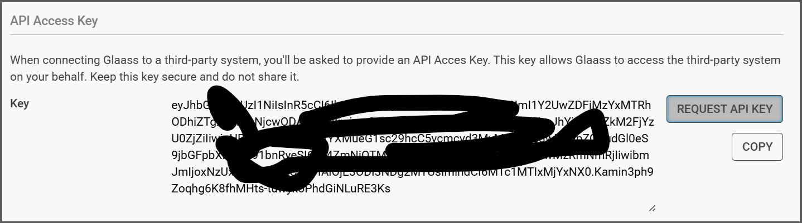

# Glaass Pro Connector

Glaass Pro is an adaptable construction management platform that helps general contractors save time, reduce mistakes, and connect teams through one simple organised platform.

Designed by construction professionals, for construction professionals with general contractors in mind, Glaass Pro is available on any device, online or offline, wherever you are.

Glaass Pro bundles our advanced Glaass Core with construction specific modules and customisable templates that are configurable to project needs and requirements that help deliver projects on time and on budget.

We work with international building and civil contractors to provide powerful tools that are proven to help teams work smarter with fewer delays and errors.

With a wide range of plans, inbuilt tutorials, and video demonstrations, Glaass Pro enables you to digitise your construction projects quickly and easily. Our plans are designed to suit varying project scopes and budgets.

## Publisher: Glaass Pty Ltd

## Prerequisites

You will need:

* A project provisioned in a Glaass Pro environment
* A user with an admin user type in that project
* An API key, which you can obtain at the bottom of your Personal Preferences

## Using the connector

You can use the connector in Power Apps, Power Automate and Copilot Agents.

To connect to Glaass Pro, you need to provide API key. The API key is specific to a single project and single user. The user must have admin permissions.

## Supported Operations

### Triggers

* **`Case_Created_Trigger`**: It triggers when new case is created.

* **`Case_Updated_Trigger`**: It trigger when case is updated. The list of the fields, which has been updated, is provided in the trigger.

* **`Case_Closed_Trigger`**: It triggers when case is closed. Note that API can recognize closing case as an update, so closing the case can also trigger `Case_Updated_Trigger` (with field Status as changed).

### Actions

* **`Account_Get`**: Retrieves connection account information, i.e. user name and project name.

* **`CaseType_GetList`**: Gets list of case templates within project.

* **`Search_Get`**: Gets a list of the search results based on the query and filter. Using filter you can limit the search results to only locations, companies, cases, users, or groups.

* **`Case_Get`**: Gets case details for technical case ID, including title, status, revision and information about date and time of case creation, and about case creator.

* **`CaseField_Get`**: Gets all sections and fields for a case for technical case ID. The result contains technical as well as human-readable value of the fields.

* **`CasePrint_Post`**: Starts printing of a case by technical case ID. If asynchronous is true, it returns a link to check the progress of the print request. If asynchronous is false, call is blocked until the print is ready and returns the print result directly. The print result is a PDF file with the case details (the same as printing in application).

* **`CasePrint_Get`**: Gets a progress of the print request or final print result by technical case ID and print request ID. If the print is not ready yet, it returns empty result.

* **`CaseReply_Get`**: Gets a list of default recipients for the case reply for technical case ID. This is the same list of recipients like the one pre-filled in the reply form in the application.

* **`CaseReply_Post`**: Posts a reply to the timeline of the case for technical case ID. If parameter "Without notification" is false, the reply is sent to default recipients, if true, it is sent to connected user (thus there are no users notified).

## Obtaining Credentials

Login to Glaass Pro using the [usual link](https://app.glaass.com) and navigate to project and then to your Personal Preferences. Scroll to the bottom of the page to find your API key.

## Known Issues

API access (also through the connector) is available only to users with admin permissions in the project. If you are not an admin, you will not be able to use the connector.

## Deployment Instructions

You can either use certified connector available in platform. Or you can deploy the connector, using provided definition file and [custom connector CLI utility](https://learn.microsoft.com/en-us/connectors/custom-connectors/paconn-cli).
