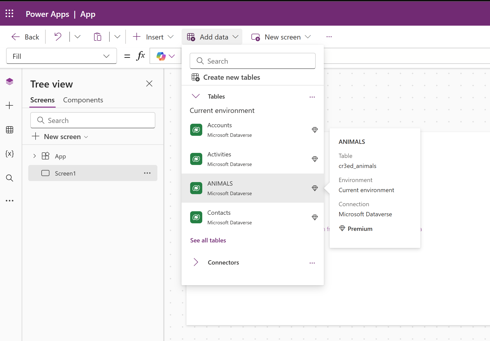

## Connector in-depth
This article describes the capabilities and actions of the Snowflake connector.

### Supported Capabilities for Power Automate
- Users can create flows and add actions to execute and get back results of custom SQL statements with the Snowflake connection.

### Supported Capabilities for Power Apps
- Users should first create virtual tables and then load them into apps with the Snowflake connection (a connection created using only 'Service Principal authentication'). Learn how to create Virtual tables: [Create and edit virtual tables with Microsoft Dataverse - Power Apps | Microsoft Learn](https://learn.microsoft.com/power-apps/maker/data-platform/create-edit-virtual-entities).

### Supported Capabilities for Logic Apps
- Users can create flows and add actions to execute and get back results of custom SQL statements with the Snowflake connection.

## Virtual Network Support
With Azure Virtual Network support for Power Platform, users can integrate Power Platform with resources inside their virtual network without exposing them over the public internet. To connect to Virtual Network, please make sure to follow both steps mentioned below.
1. Learn how to setup [Azure Private Link and Snowflake](https://docs.snowflake.com/user-guide/privatelink-azure)
1. Learn how to setup [Virtual Network support for Power Platform](https://learn.microsoft.com/power-platform/admin/vnet-support-setup-configure)

To know more about Virtual network, please check [Virtual Network support overview](https://learn.microsoft.com/power-platform/admin/vnet-support-overview).

## Prerequisites
- Users must have Microsoft Entra ID for the external authorization. The authorization flow for PowerApps leverages the Service-Principal, and Power Automate will support both Service-Principal and on-behalf-of-user flows.
- Users must have a premium Power Apps license.
- Users must have a Snowflake account. 

#### A few things that must be kept in mind regarding configuration for using the Snowflake connector
1. The authorization server can grant the OAuth client an access token on behalf of the user, referred to `DELEGATED BASED AUTH`.
1. The authorization server can grant the OAuth client an access token for the OAuth client itself, referred as `SP BASED AUTH`.
1. For Oauth client, make sure to add a Redirect URI (Web based) for delegated based `AUTH`.  
    Redirect URI - `https://global.consent.azure-apim.net/redirect/snowflakev2` 
    
1. A security integration with audiences must be created. 
1. For delegated based authentication, `external_oauth_token_user_mapping_claim = 'upn'` 
1. For sp based authentication, `external_oauth_token_user_mapping_claim = 'sub'`
1. At time of creating the security integration, describe the integration created and check if the role given to the user of Snowflake is in the blocked list or not. If in the blocked list, then either change or remove the role of the user in the blocked list.   
    
1. Ensure that the `login_name` and roles are correctly set in the Snowflake account. This can be checked via Admin Tab > Users and Roles > Select a user and Edit the user details.   
    

## Configuration Steps

#### A. Configure the OAuth resource in Microsoft Entra ID   
1. Navigate to the [Microsoft Azure Portal](https://portal.azure.com/) and authenticate.
1. Navigate to Microsoft Entra ID.
1. Click on **App Registrations**.
1. Click on **New Registration**.
1. Enter 'Snowflake OAuth Resource', or similar value as the **Name**.
1. Verify the **Supported account types** are set to **Single Tenant**.
1. Click **Register**.
1. Click on **Expose an API**.
1. Click on the link next to **Application ID URI** to add the Application ID URI. Application ID URI will be of the format `Application ID URI <api://9xxxxxxxxxxxxxxxxxx>`
1. For **Delegated Auth** (screenshots [here](https://community.snowflake.com/s/article/External-oAuth-Token-Generation-using-Azure-AD)):
    1. Click on **Add a Scope** to add a scope representing the Snowflake role.
    1. Select who can consent.
    1. Add a description.
    1. Click Add Scope to save.     
    Example: `session:scope:analyst`   
      
         **OR**    
      
1. For **Service Principal Auth** (screenshots [here](https://community.snowflake.com/s/article/Create-External-OAuth-Token-Using-Azure-AD-For-The-OAuth-Client-Itself)):   
To add a Snowflake Role as a Role for OAuth flows where the programmatic client requests an access token for itself:   
    1. Click on **Manifest**.
    2. Locate the `appRoles` element.
    3. Enter an **App Role** with the following settings, the Snowflake role should be the one which has access to a warehouse, and usage privileges on the schema (check [here](https://docs.snowflake.com/user-guide/oauth-azure#label-configure-oauth-resource-in-microsoft-idp) for details on manifest vales).
    4. See the sample definition below:       
            The App Role manifests as follows. Avoid using high-privilege roles like `ACCOUNTADMIN`, `SECURITYADMIN` or `ORGADMIN`.  
         
            "appRoles":[
                {
                    "allowedMemberTypes": [ "Application" ],
                    "description": "Analyst.",
                    "displayName": "Analyst",
                    "id": "3ea51f40-2ad7-4e79-aa18-12c45156dc6a",
                    "isEnabled": true,
                    "lang": null,
                    "origin": "Application",
                    "value": "session:role:analyst"
                }
            ]
    5. Click Save   
1. Optionally, if a security integration is already being used in Snowflake with another Microsoft product such as PowerBI and with a different claim mapping, the manifest will need to be modified. The manifest will need to emit tokens using a different issuer, so that a separate security integration in Snowflake with the unique claim mapping can be created.   
    a. Click on **Manifest**.  
    b. Find the attribute `requestedAccessTokenVersion` and set the value to "2".   
    - When `requestedAccessTokenVersion` is set to "2", the Access Token is going to have an issuer of format: `https://login.microsoftonline.com/<Tenant-ID>/v2.0`
    - When `requestedAccessTokenVersion` is set to "1", the Access Token is going to have an issuer of format: `https://sts.windows.net/<tenant-ID>/`   
    c. Click Save. 
   

#### B. Create an OAuth client in Microsoft Entra ID   
1. Navigate to the [Microsoft Azure Portal](https://portal.azure.com/) and authenticate.
1. Navigate to Azure Active Directory.
1. Click on **App Registrations**.
1. Click on **New Registration**.
1. Enter a name for the client such as 'Snowflake OAuth Client'.
1. Verify the Supported account types are set to Single Tenant.
1. Click Register.
1. In the **Overview** section, copy the `ClientID` from the **Application (client) ID** field. This will be known as the `<OAUTH_CLIENT_ID>` in the following steps.
1. Click on **Certificates & secrets** and then **New client secret**.
1. Add a description of the secret.
1. For testing purposes, select long-living secrets but for Production follow necessary security policies.
1. Click **Add**. Copy the secret. This will be known as the `<OAUTH_CLIENT_SECRET>` in the following steps.
1. For **Delegated Auth**:  
    a. Click on **Manage** -> **API Permissions**.   
    b. Click on **Add Permission**.   
    c. Click on **My APIs**.   
    d. Click on the **Snowflake OAuth Resource** that was created in [Configure the Oauth Resource in Microsoft Entra ID ](#a-configure-the-oauth-resource-in-microsoft-entra-id)   
    e. Click on the **Delegated Permissions** box.   
    f. Check on the **Permission** related to the Scopes manually defined in the Application that are wished to be granted to this client.   
    g. Click **Add Permissions**.   
    h. Click on the **Grant Admin Consent** button to grant the permissions to the client. Note that for testing purposes, permissions are configured this way. However, in a production environment, granting permissions in this manner is not advisable.   
    i. Click **Yes**.   
    j. Click Manage -> Authentication, add a platform - > Web and enter Redirect URI's   
    `https://global.consent.azure-apim.net/redirect/snowflakev2`   
     
             **OR**    
     
1. For **Service Principal Auth**:  
    a. Click on **Manage** -> **API Permissions**.   
    b. Click on **Add Permission**.   
    c. Click on **My APIs**.   
    d. Click on the **Snowflake OAuth Resource** that was created in [Configure the Oauth Resource in Microsoft Entra ID ](#a-configure-the-oauth-resource-in-microsoft-entra-id).      
    e. Click on the **Application Permissions** box.   
    f. Check on the Permission related to the Roles manually defined in the Manifest of the Application that are wished to be granted to this client.   
    g. Click **Add Permissions**.   
    h. Click on the **Grant Admin Consent** button to grant the permissions to the client. Note that for testing purposes, permissions are configured this way. However, in a production environment, granting permissions in this manner is not advisable.  
    i. Click Yes.  

#### C. Collect Azure AD information for Snowflake   
1. Navigate to the [Microsoft Azure Portal](https://portal.azure.com/) and authenticate.
1. Navigate to Azure Active Directory.
1. Click on **App Registrations**.
1. Click on the Snowflake OAuth Resource that was created in [Configure the Oauth Resource in Microsoft Entra ID ](#a-configure-the-oauth-resource-in-microsoft-entra-id).   
1. Click on Endpoints in the Overview interface.
1. On the right-hand side, copy the **OAuth 2.0 token endpoint (v2)** and note the URLs for **OpenID Connect metadata** and **Federation Connect metadata**.
- The OAuth 2.0 token endpoint (v2) will be known as the `<AZURE_AD_OAUTH_TOKEN_ENDPOINT>` in the following configuration steps. The endpoint should be similar to `https://login.microsoftonline.com/<tenant-id>/oauth2/v2.0/token`.
- For the **OpenID Connect metadata**, open in a new browser window.
    - Locate the `jwks_uri` parameter and copy its value.
    - This parameter value will be known as the `<AZURE_AD_JWS_KEY_ENDPOINT>` in the following configuration steps. The endpoint should be similar to `https://login.microsoftonline.com/<tenant-id>/discovery/v2.0/keys`.
- For the **Federation metadata document**, open the URL in a new browser window.
    - Locate the `"entityID"` parameter in the `XML Root Element` and copy its value.
    - This parameter value will be known as the `<AZURE_AD_ISSUER>` in the following configuration steps. The entityID value should be similar to `https://sts.windows.net/<tenant-id>/`.

#### D. Validate Entra Authorization setup     
It is recommended the configuration be tested at this time, please use the curl below and check if Entra is issuing a token using any API testing tool such as Insomnia or others.  

- Delegated Auth: (Optional) 
  - A prior step must be executed to get the code, [this document](https://learn.microsoft.com/entra/identity-platform/v2-oauth2-auth-code-flow) can be followed     

        curl --request POST --url https://login.microsoftonline.com/<TENANT_ID>/oauth2/token --header 'Content-Type: multipart/form-data' --form client_id=<AAD_CLIENT_ID> --form client_secret=< AAD_CLIENT_SECRET> --form resource=< AAD_RESOURCE_ID> --formgrant_type=authorization_code --form code=<CODE_GENERATED_ABOVE> --form redirect_uri=https://localhost

  - Note: Please add the redirect URI in the AAD client app.   

**OR**   

- Service Principal Auth:    

      curl -X POST -H "Content-Type: application/x-www-form-urlencoded;charset=UTF-8" \ --data-urlencode "client_id=client_id from above B.8" \ --data-urlencode "client_secret=<Secret from above B.12>" \ --data-urlencode "grant_type=client_credentials" \ --data-urlencode "scope=api://<Appl_URI_ID>/.default" \'https://login.microsoftonline.com/<tenant_id>/oauth2/v2.0/token'

To validate the token, execute the below command in Snowflake:   

    select system$verify_external_oauth_token(‘<token>’);

#### E. Create a security integration with audiences     
The `external_oauth_audience_list` parameter of the security integration must match the Application ID URI that was specified while configuring Microsoft Entra ID.      

- Delegated Auth:   

      create security integration external_oauth_azure_1    
          type = external_oauth
          enabled = true
          external_oauth_type = azure
          external_oauth_issuer = '<AZURE_AD_ISSUER>'
          external_oauth_jws_keys_url = '<AZURE_AD_JWS_KEY_ENDPOINT>'
          external_oauth_audience_list = ('<SNOWFLAKE_APPLICATION_ID_URI>')
          external_oauth_token_user_mapping_claim = ‘upn’ 
          external_oauth_snowflake_user_mapping_attribute = 'login_name or email address';

If Security Integration for Azure AD is already set up, then use:    

    alter security integration external_oauth_azure_1 set external_oauth_token_user_mapping_claim = ('sub','upn');  

In the case of Delegated Authentication, the Snowflake user’s `login_name` or `email_address` should match the Entra email of the user who will run the Power Automate flow.  

Example:   

    ALTER USER SNOWSQL_DELEGATE_USER  
    LOGIN_NAME = '<ENTRA-USERID>' or EMAIL_ADDRESS = ‘ENTRA-USERID’ 
    DISPLAY_NAME = 'SnowSQL Delegated User'  
    COMMENT = 'A delegate user for SnowSQL client to be used for OAuth based connectivity'; 

**OR**   

- Service Principal Auth:  

      create security integration external_oauth_azure_2 
          type = external_oauth 
          enabled = true 
          external_oauth_type = azure 
          external_oauth_issuer = '<AZURE_AD_ISSUER>' 
          external_oauth_jws_keys_url = '<AZURE_AD_JWS_KEY_ENDPOINT>' 
          external_oauth_audience_list = ('<SNOWFLAKE_APPLICATION_ID_URI>') 
          external_oauth_token_user_mapping_claim = ‘sub’     
          external_oauth_snowflake_user_mapping_attribute = 'login_name';

Continue below for Service Principal Authentication setup only.   

Create a user for Service Principal based connection:
- The subvalue should be mapped to a user in Snowflake, avoid using high privilege accounts Accountadmin, Orgadmin, Securityadmin.  

      CREATE OR REPLACE USER SNOWSQL_OAUTH_USER  
      LOGIN_NAME = '<subvalue from decoded token>'  
      DISPLAY_NAME = 'SnowSQL OAuth User'  
      COMMENT = 'A system user for SnowSQL client to be used for OAuth based connectivity'; 

      CREATE ROLE ANALYST; 

      GRANT ROLE ANALYST TO USER SNOWSQL_OAUTH_USER;

#### F. Validate Snowflake Access [Optional] 
- Delegated Auth

      snowsql -a organization-locator -u 'user@sandbox.onmicrosoft.com' --rolename <rolename> --authenticator oauth --token "<token-value>"
 
**OR**   

- Service Principal Auth 

      snowsql -a <snowflake-accountname> -u ‘sub-value’ -r <snowflake-role from A.11.h above> –authenticator oauth –token <output from curl at step D> 

### Customers using Snowflake Connector [DEPRECATED]
Applicable: All regions 

To migrate from an older Snowflake connector to the new one, please follow the steps below.  

This option is only for older connections without an explicit authentication type and is only provided for backward compatibility. 

If a Power Automate flow using a prior connectorhas been built (now marked as deprecated), a new connection will need to be set up following the steps documented under Configuration Steps above, and update the existing flows to use the new connection.   

The action "Convert result set rows from array to objects" would also need to be dropped as that functionality is now wrapped in "Check the Status and Get Results".   

## Known issues and limitations
1. We currently do not support duplicate columns when the join command is executed. A workaround would be to add aliases to the duplicated columns. 
1. Other limitations with Virtual Tables are listed [here](https://learn.microsoft.com/power-apps/maker/data-platform/create-edit-virtual-entities#considerations-when-you-use-virtual-tables).
1. Virtual tables are only supported with connections created with 'Service Principal' authentication. 
1. When using Service Principle authentication, the user needs to have Read access to the **information_schema.columns** table. 
1. Snowflake connections cannot be created directly in Canvas apps, error information and steps which are needed to resolve the issue are as follows:  
   
 
   1.  An error will show if the Snowflake connection is created directly in a Canvas app as shown in the below screenshot 
   
   
   1.  Instead of adding the connector directly in the Canvas app, create a service principal connection (not delegated) from outside of the Canvas app 
   1.  Use the Snowflake connection created above and create a virtual table 
   
   1.  Afterwards, the virtual table can be loaded in the Canvas app and build out of the Canvas app can proceed
   
   1. The ANIMALS table above is a virtual table, created using the Snowflake Connection as mentioned above

> [!NOTE]
> 1. Users always need to make sure that all of the Snowflake account details (warehouse, role, schema, database) are in the same letter case as the Snowflake account while configuring the connection/flow-actions. 
> 1. As a validation step for both Delegated and Service Principal based connections, please create a Power Automate flow to validate the connection. 