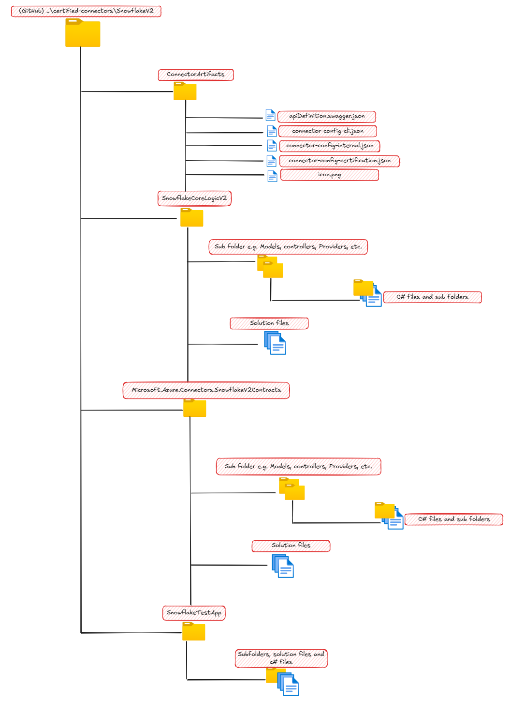

# Solution Documentation

## Brief overview
This connector is based on the [Snowflake SQL REST API](https://docs.snowflake.com/en/developer-guide/sql-api/index.html). Snowflake enables data storage, processing, and analytic solutions that are faster, easier to use, and more flexible than traditional offerings. Snowflake Connector allows you to build canvas apps and surface Snowflake data in Virtual Tables, while also enabling faster data processing and analytics compared to traditional solutions.

## System requirement
- .Net Framework 4.8
- Visual Studio or Visual Studio Code
- C# language version 8+
## Project Structure
There are 4 key components to this solution. 3 C# projects and a collection of connector artifacts. These elements are shown and explained below:

### 1. Contracts
The `contracts` folder contains a C# class library project that provides key constants, interfaces and models needed to compile and debug the Snowflake core connector logic. This contract is exposed by Microsoft and is intended to be readonly for contributors. The `SnowflakeV2CoreLogic` project takes a direct dependency on this project, so to successfully build and test any core logic changes, you need the `Contracts`, but no changes are necessary.

### 2. SnowflakeV2CoreLogic
`SnowflakeV2CoreLogic` project is the key connector logic for the Snowflake V2 connector. This project contains the Providers and Controllers that implement the CDP protocol and encapsulates logic that ineteract with Snowflake backend API. Any new feature addition or modification of exisiting functionalities needs to be made in this project. This is a class library project, so it is not directly executable.

### 3. SnowflakeTestApp
The `SnowflakeTestApp` is a C# Web API project that serves as a shell to execute and debug `SnowflakeV2CoreLogic`. This project is provided solely for test purposes, both for local debugging and for deployment to a web server (e.g. Azure App Service) and supports both OData and OpenAPI routes for the controllers. `ConnectionParametersProviderMock.cs` class provides an easy way to provide test Snowflake server and connection properties for testing.

Controllers and providers are injected into the DI container for the tesh shell in the `SnowflakeModule.cs` class. This means that if new providers or controllers are added, you need to inject them through `SnowflakeModule.cs` inorder to test them through the test web app.  

### 4. Connector Artifacts 
These are artifacts specific to Snowflake V2 connector and they are described below:

- `apidefinition.swagger.json`: This is the OpenAPI specification for the Snowflake V2 connector REST API. It contains the endpoints, operations, paratemers, request/response formats for the connector APIs. These are the APIs exposed in the `SnowflakeV2CoreLogic` controllers. When a new API is added, or an existing API definition is updated or removed from `SnowflakeV2CoreLogic` controllers, this swagger file should be updated to reflect the change(s).

- `connector-config-certification.json`: Contains relevant connector properties for certification purposes.

- `connector-config-cli.json`: Contains branding and capability properties of the connector.

- `connector-config-internal.json`: Contains connector's metadata and supported authentication type properties.

- `icon.png`: The Snowflake connector icon used for branding.

## Testing
While modifying the code, you would want to test your changes and make sure of the validity of the changes before you submit them for certification and deployment. One option is to [create unit tests](https://learn.microsoft.com/en-us/visualstudio/test/walkthrough-creating-and-running-unit-tests-for-managed-code?view=vs-2022#create-a-unit-test-project) and ensure that the unit of code perform as expected. The `contracts` exposes all relevant interfaces that will be required for mock purposes.

### Local API debugging
You can run the code, call the REST APIs, or debug locally using the `SnowflakeTestApp`. This can be quite useful while making code changes, as it reduces the dev loop for testing your changes. To debug locally, follow these steps:

- Build the test app project: Right-click on the `SnowflakeTestApp` project, click `Build`.
- Press `F5` or right-click on the `SnowflakeTestApp` project, click `Debug` and use your favorite API client (e.g. Postman) to call the REST APIs.

Note: You need to have IIS express installed on the machine. If you have visual studio and .Net installed, IIS express would already be installed for you.

### End to End Tests
The provided `SnowflakeTestApp` project also simplifies the process of testing your changes independently without tight collaboration with the platform team. The steps outlined below describes how you can build the test app, deploy it to an Azure App service within your subscription, and test against that deployed app.

Note: This guide is written with a focus on using Visual studio for development, and the deployment of the test app to Azure, but you can also deploy the application to your own suitable IIS server, or use Visual studio code for development instead of Visual studio. 

Steps:
- Update the `GetProperty` method of `ConnectionParametersProviderMock.cs` class in the Test App with your Snowflake account details that you want to test against.
- If needed, update the `GetToken` method of `ConnectionParametersProviderMock.cs` class with the token necessary to call the backend Snowflake API. The default behavior is set for the backend token to be passed through the `Authorization` header of the calling client. 
- Build the test app project: Right-click on the `SnowflakeTestApp` project, click `Build`.
- For the next step, Ensure that you select a `Windows` App service, `.Net 4.8` framework, and select `64 Bit` platform. If you have an existing App service, while following the documentation below, select your app servie instead of creating a new one. For a clean deployment, while at the web deploy publish settings, check `Remove additional files at destination` under `File Publish Options`.
- Follow the [documentation to create your App service and deploy the test app](https://learn.microsoft.com/en-us/azure/app-service/quickstart-dotnetcore?tabs=netframework48&pivots=development-environment-vs#publish-your-web-app).
- Once deployed, get the `Default domain` property from the deployed web app from Azure portal. This is the host you will for testing your api.
- Creating custom connector
	- Import the apidefinition.swagger.json file in PowerPlatform env as detailed [here](https://learn.microsoft.com/en-us/connectors/custom-connectors/define-openapi-definition#import-the-openapi-definition-for-power-automate-and-power-apps). or you can create a custom connector in other ways as documented [here](https://learn.microsoft.com/en-us/connectors/custom-connectors/learn-with-a-tutorial).
	- Update the Host in General section to point to your local/remote webapp instance
	- For authentication under Security section, Choose according to how you would like to pass the token to the webapp. This is the token required to call backend Snowflake API.
		- No auth: if you want to aquire token in `ConnectionParametersProviderMock.cs` during runtime.
		- ApiKey: if you want to pass the token manually from the custom connector.
		- OAuth: if you want to setup your own entra app to aquire token automatically and have it passed down to the webapp.
	- Save the connector using `Create connector`.
- Once the custom connector is created, you can test the various operations using the `Test` section as detailed [here](https://learn.microsoft.com/en-us/connectors/custom-connectors/define-blank#step-6-test-the-connector).
	- You can also test the 3 SQL operations in a [flow using custom connector](https://learn.microsoft.com/en-us/connectors/custom-connectors/use-custom-connector-flow).
	- Note: You will have to test the CDP operations from Test section only.

